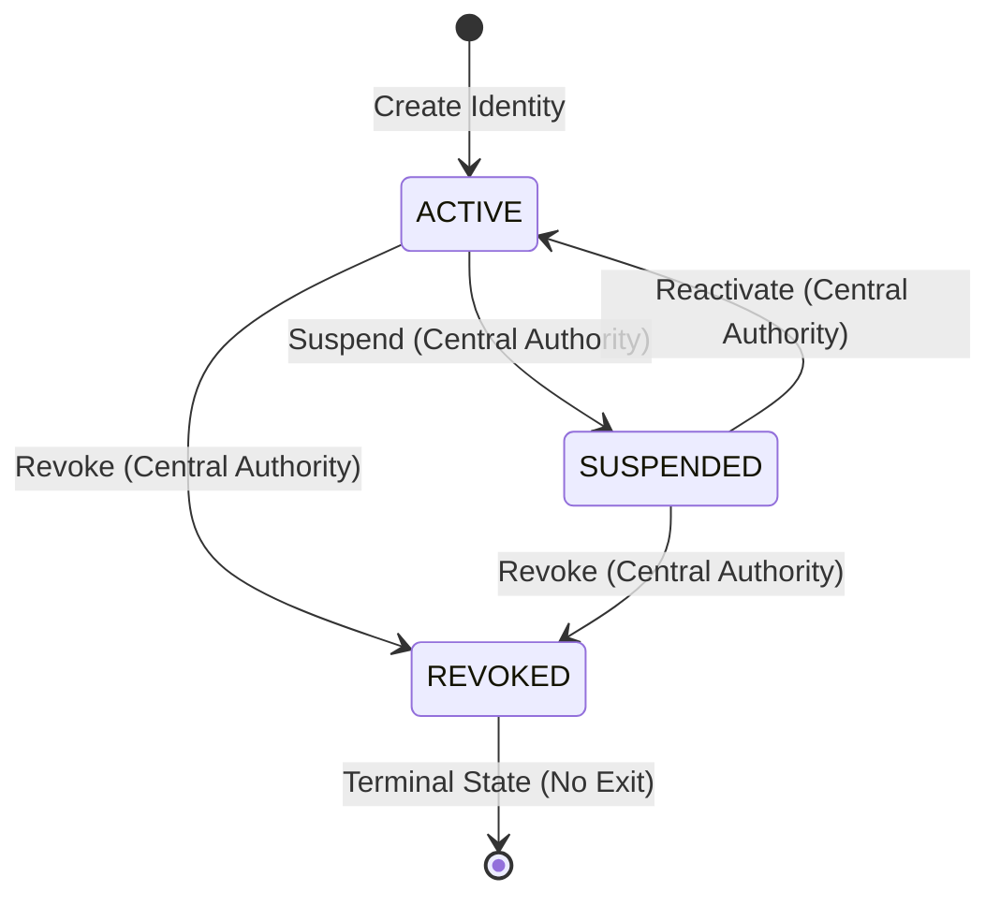
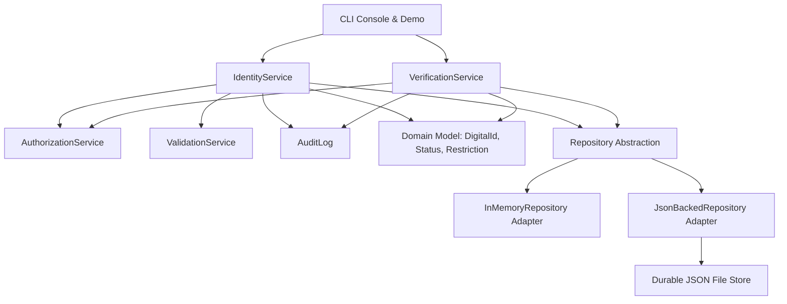

# Digital Identity Control System (DICS)

[](https://github.com/Shrey-Jaiswal/Python-Individual-Coursework/actions/workflows/ci.yml?query=branch%3Amain)
[](coverage.svg)

**GitHub Repository**: [https://github.com/Shrey-Jaiswal/Python-Individual-Coursework](https://github.com/Shrey-Jaiswal/Python-Individual-Coursework)

This is a console backend for managing digital identities and running verification checks.

The system acts as a central registry for citizen identities, enforcing status transitions,
restriction periods, and immutable fields. External organizations (like tax offices, licensing
authorities, or banks) can query the register to verify eligibility under different access roles,
without exposing raw personal profile data.

---

## Project aims and context

Managing national identity credentials involves three main concerns:
1. Security and control: Only authorized administrators should register citizens, edit profiles,
   or issue restrictions. Compromised accounts must be permanently revoked.
2. Privacy and data minimization: Third party organizations checking status should receive only
   the minimum data needed to answer their query. For example, a bank does not need a citizen's
   birth date just to check if their ID is active.
3. Traceability: The system must log every transaction—whether successful, denied, or a repetitive
   no-op—in a chronological audit file.

DICS handles these concerns using simple, clean coding practices:
- Domain validation: Invariant rules live directly inside the domain entities.
- Role boundaries: The system checks user permissions at the start of every transaction.
- Read-only snapshots: The backend returns immutable snapshots to the user interface, and simple
  yes-or-no results to external verifiers.

---

## Core domain rules and status transitions

At the core of the system is the `DigitalId` domain aggregate, which handles citizen records and
enforces three main invariants:

### 1. Locked attributes
Once you register an identity, you cannot change its core identifiers:
- Digital ID (system key)
- National ID (tax or social security number)
- Date of birth (used for age checks)

Any attempt to update these fields throws an error, which is logged and denied.

### 2. Status lifecycle
Identities transition between three lifecycle statuses, governed by strict transition rules:



- active: The identity is fully functional and eligible for standard verification checks.
- suspended: The identity is temporarily frozen (for example, during a security review). It fails
  verification checks but can be reactivated by an administrator.
- revoked: The identity is permanently terminated. This is a terminal state. You cannot reactivate
  a revoked record, and you cannot edit any of its attributes.

### 3. Redundant operations (no-ops)
To avoid conflict errors, repeating a status command (such as activating an already active record)
is handled as a safe no-op. The system records the outcome in the audit file as a no-op and
returns without throwing errors or crashing.

---

## Organisation-specific verification rules

Instead of giving external organizations direct access to citizen data, the system uses custom
verifiers that return minimal true-or-false decisions:

| Authority Organization | Required Access Role | Core Verification Logic | Information Returned |
| :--- | :--- | :--- | :--- |
| **Tax Authority** | `Role.TAX_AUTHORITY` | Checks that the ID is active, the tax period is ended, and the record was never suspended or revoked during that period. | Returns eligibility boolean and reason. |
| **Driving Licence Authority** | `Role.DRIVING_LICENCE_AUTHORITY` | Checks that the ID is active and has no current restrictions matching driving keywords. | Returns eligibility boolean and reason. |
| **Local Authority** | `Role.LOCAL` | Checks that the ID is active and the residential address contains the requested locality. | Returns eligibility boolean and reason. |
| **Bank / Employer** | `Role.BANK_EMPLOYER` | Checks only that the ID is currently active. | Returns eligibility boolean only (hides the reason). |

---

## Scripted demo execution matrix

When you run the application, it executes an automated 24-step scenario checklist to demonstrate how
the backend handles happy paths, edge cases, and unauthorized requests:

| Step | Scenario | Action | Expected Outcome | Rule Verified |
| :---: | :--- | :--- | :---: | :--- |
| **01** | Create identity | Central register creates citizen `did-1` | **PASS** | Valid registration. |
| **02** | Repeat active status | Try to set status to active again | **NO-OP** | Redundant status check. |
| **03** | Update identity | Change address to "2 High Street, London" | **PASS** | Permitted attribute edit. |
| **04** | Domain immutable update | Attempt to overwrite `national_id` | **REJECTED** | Locked attributes block. |
| **05** | Duplicate identity | Register another user with `nat-1` | **REJECTED** | Unique national ID check. |
| **06** | Unauthorized revoke | Local role tries to revoke `did-1` | **REJECTED** | Role-based protection. |
| **07** | Unauthorized verification | Bank tries to run a tax query | **REJECTED** | Access boundaries. |
| **08** | Suspend identity | Central role suspends `did-1` | **PASS** | Temporary freeze. |
| **09** | Tax verification (suspended) | Tax authority queries suspended ID | **INELIGIBLE** | Suspended accounts fail checks. |
| **10** | Reactivate identity | Central role reactivates `did-1` | **PASS** | Profile reactivation. |
| **11** | Tax verification (history) | Run tax check; history has suspension | **INELIGIBLE** | Evasion audit check. |
| **12** | Tax period check failure | Query tax for an unfinished period | **INELIGIBLE** | Period must be completed. |
| **13** | Add restriction | Issue a `"driving_suspension"` | **PASS** | Administrative restriction. |
| **14** | Unauthorized restriction | Local role tries to add restriction | **REJECTED** | Access boundary check. |
| **15** | Driving verification (restricted) | Run driving check with active keyword | **INELIGIBLE** | Active restriction fails check. |
| **16** | Clear restrictions | Remove all active restrictions | **PASS** | Restriction clearance. |
| **17** | Driving verification (cleared) | Run driving check again | **ELIGIBLE** | Profile is now eligible. |
| **18** | Local authority (mismatch) | Check residency for locality "Leeds" | **INELIGIBLE** | Address mismatch caught. |
| **19** | Local authority (match) | Check residency for locality "London" | **ELIGIBLE** | Address substring match. |
| **20** | Bank/employer check | Bank requests eligibility status | **ELIGIBLE** | Minimal check returns pass. |
| **21** | Missing identity lookup | Bank queries non-existent ID | **INELIGIBLE** | Graceful handle of missing IDs. |
| **22** | Revoke identity | Central role revokes `did-1` | **PASS** | Revocation applied. |
| **23** | Update revoked identity | Try to edit profile on revoked ID | **REJECTED** | Revoked records are locked. |
| **24** | Reactivate revoked identity | Try to reactivate revoked ID `did-1` | **REJECTED** | Revocation is permanent. |

---

## Architecture and code design

The system uses a layered architecture to keep core business rules separate from storage adapters
and command-line interfaces. Detailed architectural decisions, rationales, and alternatives considered are recorded in the [Architecture decisions journal](docs/ARCHITECTURE_DECISIONS.md).




### Folder structure and files
- `digital_id.domain`: Houses the core business entities (`DigitalId`, `Status`, `Restriction`,
  `StatusHistoryEntry`) and validators.
- `digital_id.services`: Implements use-cases (`IdentityService`, `VerificationService`,
  `AuthorizationService`, `ValidationService`, `AuditLog`).
- `digital_id.persistence`: Interfaces for database storage, offering memory and file-backed
  JSON adapters.
- `digital_id.cli`: Command-line and menu system interface.

---

## Audit logging

The system logs every success, no-op, and denied request directly to the active audit file.

### Example log entry
The exported `audit_log.json` file uses a simple, structured format to record details about each transaction:

```json
[
  {
    "timestamp": "2026-02-15T12:00:00Z",
    "action": "identity_created",
    "actor": "central",
    "target_id": "did-1",
    "outcome": "success",
    "details": {}
  },
  {
    "timestamp": "2026-02-15T12:00:00Z",
    "action": "status_changed",
    "actor": "local",
    "target_id": "did-1",
    "outcome": "denied",
    "details": {
      "requested_status": "revoked",
      "reason": "local is not authorized to transition status to revoked"
    }
  }
]
```

---

## How to run the application

### Installation
1. Activate a virtual environment:
   ```bash
   python -m venv .venv
   source .venv/bin/activate
   ```
2. Install the package in editable mode:
   ```bash
   pip install -e ".[dev]"
   ```

### Running the CLI
The application supports three operational modes:

#### 1. Scripted demo only
Runs the automated scenario checklist and writes the audit trail:
```bash
python -m digital_id --scripted-only --audit-path audit_log.json
```

#### 2. Hybrid run (Demo then Interactive Menu)
Runs the compliance checks, then opens the control center console:
```bash
python -m digital_id
```

#### 3. Persistent database mode
Operates directly against a JSON database file, saving records between sessions:
```bash
mkdir -p data
python -m digital_id \
  --interactive-only \
  --store-path data/digital_ids.json \
  --audit-path data/audit_log.json
```

---

## Testing and code quality

Correct system behavior and rules are verified through automated tests, linting, and static typing checks.

### Running tests
The test suite covers happy paths, edge cases, date boundaries, and role rejections:
```bash
# Run all tests
python -m pytest

# Run tests with a coverage summary
python -m pytest --cov
```
*Note: The project pyproject.toml configuration enforces a minimum 95% test coverage gate.*

### Style and lint checks
To check formatting and static typing:
```bash
# Run Ruff lint check (all lines must stay under 100 characters)
python -m ruff check src tests

# Run MyPy type checker
python -m mypy src --config-file pyproject.toml
```

---

## Development log and Git history

This project followed incremental development steps:
- Development log: Tickets and commit progression are documented in [DEVELOPMENT_EVIDENCE.md](docs/DEVELOPMENT_EVIDENCE.md).
- Issue list: Ticket statuses are listed in [issues.csv](issues.csv) and updated on the board.
- Continuous Integration: GitHub Actions runs all tests, type checks, and linters on every commit.
