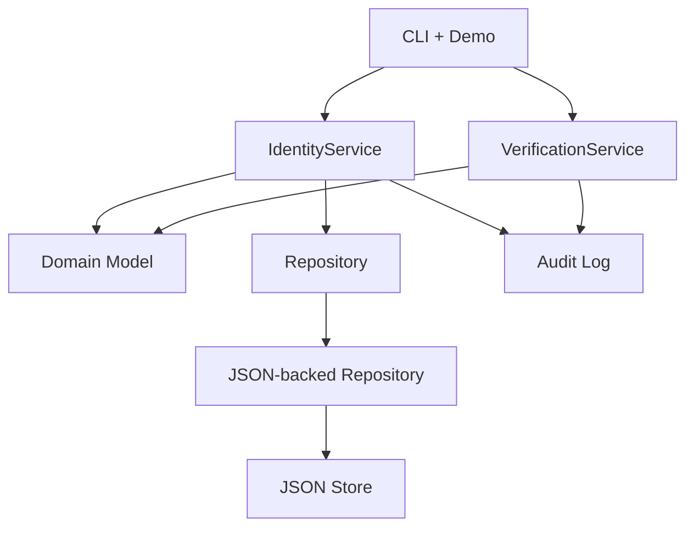

# Python-Individual-Coursework

[](https://github.com/Shrey-Jaiswal/Python-Individual-Coursework/actions/workflows/ci.yml?query=branch%3Amain)
[](coverage.svg)

## GitHub repository
https://github.com/Shrey-Jaiswal/Python-Individual-Coursework/

## Overview
Console-based backend for Digital ID lifecycle management. A central authority creates and
updates identities and changes status, while other organisations only verify identities
through role-specific rules. The system enforces deterministic rules (immutable attributes,
status transitions, restriction validity) and records both successful and denied audit events
for traceability.

## Quick start
### Requirements
- Python 3.11+

### Setup
```bash
python -m venv .venv
source .venv/bin/activate
pip install -e ".[dev]"
```

### Scripted demo
```bash
python -m digital_id --scripted-only --audit-path audit_log.json
```

### Interactive demo
```bash
python -m digital_id
```

### Persistent interactive runtime
```bash
python -m digital_id \
  --interactive-only \
  --store-path data/digital_ids.json \
  --audit-path data/audit_log.json
```
This mode reloads identities from the JSON store and persists each create, update, status
change, and restriction change. The audit log also reloads existing entries and persists
each successful, failed, or denied action.

### Audit log
The scripted run exports a JSON audit log (default: `audit_log.json`) that includes
creation, updates, status changes, restriction changes, verification requests, and denied
operations.

## Scripted demo summary
The scripted demo exercises representative success and failure paths:
- create an identity and update mutable fields
- reject a duplicate create request
- reject an unauthorised status change
- treat a repeated status change as a deterministic no-op
- add and clear restrictions through central-authority service methods
- reject unauthorised restriction and verification requests
- suspend/reactivate/revoke and run tax, driving, local authority, and bank verifications
- show tax verification using status history, not only current status
- show missing identity lookup and update-after-revoked rejection
- export an audit log with all recorded actions

## Architecture overview
**Key modules**
- `digital_id.domain`: core model (`DigitalId`, `Status`, `Restriction`, history) and invariants.
- `digital_id.services`: application rules (identity management, verification, validation,
	authorization, audit logging).
- `digital_id.persistence`: repository abstraction plus in-memory and JSON-backed storage.
- `digital_id.cli` / `digital_id.demo`: console entrypoint and deterministic demo runner.



## Design decisions
Detailed design rationale is documented in
[Architecture Decisions](docs/ARCHITECTURE_DECISIONS.md). In summary:
- services own business workflows and audit side effects
- repositories return defensive copies to protect aggregate state
- persistent runtime storage is adapter-based and optional for the deterministic demo
- audit logging is file-backed when configured with `--audit-path`
- identity management returns immutable `IdentitySnapshot` DTOs rather than mutable aggregates
- verification returns limited `VerificationResult` responses to consuming organisations

## Verification flows (examples)
- Tax authority: identity must be active and the reporting period must be complete.
- Driving licence: identity must be active and have no active restrictions matching
	licence-related keywords.
- Local authority: identity must be active and address must match a required locality.
- Bank/employer: validity-only response (active vs not active), with no identity attributes
	returned to the caller.

## Rules and invariants
- Immutable identity attributes: `digital_id`, `national_id`, `date_of_birth`.
- Status transitions: active <-> suspended; revoked is terminal.
- Updates and restriction changes on revoked identities are rejected.
- Restriction changes are central-authority only and are audited.
- Repeated status operations are deterministic no-ops.
- Verification requests accept only a `digital_id`; the service resolves records internally and
	returns a limited `VerificationResult`.
- Identity management returns immutable snapshots instead of mutable domain aggregates.
- Rejected/denied operations are recorded with `outcome=denied` and a reason.

## Testing and CI
Run locally:
```bash
python -m pytest
python -m pytest --cov
python -m ruff check src tests
python -m mypy src --config-file pyproject.toml
```

CI runs on every push and pull request (lint, type check, tests with coverage output).
The test suite enforces a minimum 95% coverage threshold.
*(Note: `pytest` is used as the standard Python-ecosystem equivalent to the JUnit framework)*

## Development evidence
Ticket progression and status are tracked in [issues.csv](issues.csv). The overall
workflow and board sync process are documented in
[DEVELOPMENT_EVIDENCE.md](DEVELOPMENT_EVIDENCE.md).
