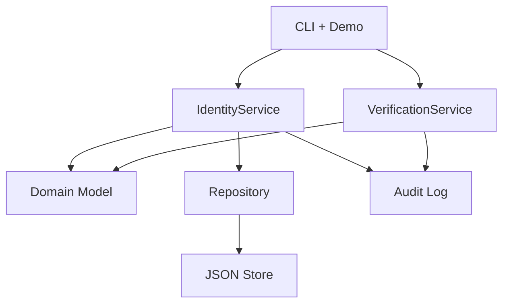

# Python-Individual-Coursework

[](https://github.com/Shrey-Jaiswal/Python-Individual-Coursework/actions/workflows/ci.yml)
[](coverage.svg)

## GitHub repository
https://github.com/Shrey-Jaiswal/Python-Individual-Coursework

## Overview
Console-based backend for Digital ID lifecycle management. A central authority creates and
updates identities and changes status, while other organisations only verify identities
through role-specific rules. The system enforces deterministic rules (immutable attributes,
status transitions, restriction validity) and records audit events for traceability.

## Quick start
### Requirements
- Python 3.11+

### Setup
```bash
python -m venv .venv
source .venv/bin/activate
pip install -e ".[dev]"
```

### Scripted demo
```bash
python -m digital_id --scripted-only --audit-path audit_log.json
```

### Interactive demo
```bash
python -m digital_id
```

### Audit log
The scripted run exports a JSON audit log (default: `audit_log.json`) that includes
creation, updates, status changes, and verification requests.

## Scripted demo summary
The scripted demo exercises representative success and failure paths:
- create an identity and update mutable fields
- reject a duplicate create request
- reject an unauthorised status change
- suspend/reactivate and run tax, driving, local authority, and bank verifications
- export an audit log with all recorded actions

## Architecture overview
**Key modules**
- `digital_id.domain`: core model (`DigitalId`, `Status`, `Restriction`, history) and invariants.
- `digital_id.services`: application rules (identity management, verification, validation,
	authorization, audit logging).
- `digital_id.persistence`: repository abstraction plus in-memory storage and JSON persistence.
- `digital_id.cli` / `digital_id.demo`: console entrypoint and deterministic demo runner.



## Verification flows (examples)
- Tax authority: identity must be active and the reporting period must be complete.
- Driving licence: identity must be active and have no active restrictions matching
	licence-related keywords.
- Local authority: identity must be active and address must match a required locality.
- Bank/employer: validity-only response (active vs not active).

## Rules and invariants
- Immutable identity attributes: `digital_id`, `national_id`, `date_of_birth`.
- Status transitions: active <-> suspended; revoked is terminal.
- Updates on revoked identities are rejected.
- Repeated operations are handled deterministically (idempotent where applicable).

## Testing and CI
Run locally:
```bash
python -m pytest
python -m pytest --cov
python -m ruff check src tests
python -m mypy src --config-file pyproject.toml
```

CI runs on every push and pull request (lint, type check, tests with coverage output).
Coverage badge values are refreshed after the latest local test run.

## Development evidence
Ticket progression and status are tracked in [issues.csv](issues.csv). The overall
workflow and board sync process are documented in
[DEVELOPMENT_EVIDENCE.md](DEVELOPMENT_EVIDENCE.md).