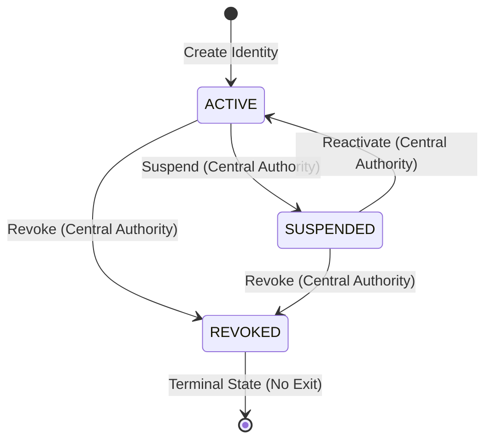
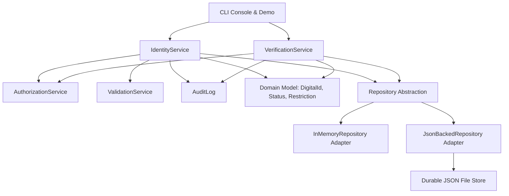

# Digital Identity Control System (DICS)

[](https://github.com/Shrey-Jaiswal/Python-Individual-Coursework/actions/workflows/ci.yml?query=branch%3Amain)
[](coverage.svg)

A production-ready, highly secure, and fully audited console-based backend for **Digital
Identity Lifecycle Management and Zero-Trust Verification**. 

This system acts as a central sovereign register of citizen identities. It enforces strict
domain-level constraints, role-based access control (RBAC), and detailed audit logs. It allows
trusted external authorities (such as Tax, Driving, Local, or Commercial entities) to execute
isolated, privacy-preserving verification queries without leaking personal data.

---

## 🎯 Project Aims & Context

In a modern digital society, managing national identity credentials requires balancing three
often-competing concerns:
1. **Security & Control**: Only authorized administrators can register citizens, update
   records, or issue temporary restrictions. Compromised accounts must be permanently revoked.
2. **Privacy & Data Minimization**: External organizations checking eligibility (e.g., checking if
   a driver has an active licence or a job applicant has an active ID) should only receive the
   absolute minimum information required to answer their query.
3. **Accountability & Traceability**: Every single transaction—including successful changes,
   no-op repetitions, and unauthorized/denied verification requests—must be logged in an
   immutable, chronological audit trail.

The **Digital Identity Control System (DICS)** solves this through clean software engineering
practices:
- **Domain-Driven Design (DDD)**: Expressing rules natively inside immutable aggregate roots.
- **Role-Based Access Control (RBAC)**: Validating authority boundaries at the entry of every
  application service transaction.
- **Information Hiding**: Returning read-only snapshot Data Transfer Objects (DTOs) to the UI,
  and minimal true/false decision cards to external organizations.

---

## ⚙️ Core Domain Rules & Lifecycle State Machine

At the heart of the system is the `DigitalId` domain aggregate, which models a citizen's state and
governs three critical invariants:

### 1. Immutability of Core Attributes
Once an identity is created, its core identifiers are physically locked:
- **Digital ID** (Primary system key)
- **National ID** (Citizen tax/social security number)
- **Date of Birth** (Determines legal age)

Any attempt to update these fields at the service or domain levels throws an
`ImmutableAttributeError` and is denied and logged.

### 2. The Status Lifecycle State Machine
Citizen identities transition dynamically through three lifecycle statuses, governed by strict
transition logic:



- **ACTIVE**: Fully functional, eligible for standard checks.
- **SUSPENDED**: Temporarily frozen (e.g., under investigation or security review). Ineligible for
  all standard checks. Can be reactivated.
- **REVOKED**: Permanently terminated (e.g., confirmed identity theft or fraud). **This is a
  terminal state**. A revoked identity can *never* be reactivated, and no mutable fields can be
  updated. Any mutation attempt is immediately blocked.

### 3. Deterministic Conflict Resolution (Safe No-Ops)
To prevent race conditions in concurrent networks, repetitive status transition commands (e.g.,
activating an already `ACTIVE` account) are resolved deterministically as safe **no-ops**. The
system records this outcome in the audit trail as `NO-OP` and returns gracefully without raising
spurious errors or crashing.

---

## 🏢 Organisation-Specific Verification Logic

Instead of giving third parties direct read access to citizen data, DICS employs **Data Minimization
Verifiers** tailored to specific organizational roles:

| Authority Organization | Required Access Role | Core Verification Logic & Rules | Information Exposed (PII Protection) |
| :--- | :--- | :--- | :--- |
| **Tax Authority** | `Role.TAX_AUTHORITY` | Verifies that: <br>1. The identity is currently `ACTIVE`. <br>2. The requested reporting tax period is completed (`period_end <= as_of`). <br>3. The identity **was never suspended or revoked at any point during that reporting period** (by analyzing the status transition history to catch retroactive tax evasion). | Returns boolean eligibility and reason. |
| **Driving Licence Authority** | `Role.DRIVING_LICENCE_AUTHORITY` | Verifies that: <br>1. The identity is currently `ACTIVE`. <br>2. The identity has **no active restrictions** whose names match licence-related keywords (e.g., `"driving_suspension"`). | Returns boolean eligibility and reason. |
| **Local Authority** | `Role.LOCAL` | Verifies that: <br>1. The identity is currently `ACTIVE`. <br>2. The residential address matches the exact locality specified (case-insensitive substring match, e.g., `"London"`). | Returns boolean eligibility and reason. |
| **Bank / Employer** | `Role.BANK_EMPLOYER` | Verifies that: <br>1. The identity is currently `ACTIVE`. <br>Does **not** process DOB, address, or restrictions. | **Zero Data Leakage**: Enforces eligibility-only true/false response. absolutely no details are returned. |

---

## 📋 Scripted Demo Execution Matrix

To demonstrate DICS under multiple operational constraints, the application runs a fully
automated **24-step scripted demo** on startup. This demo simulates Happy Paths, Edge Cases, Domain
Invariants, and Role-Based Rejections:

| Step | Scenario Title | Action Taken | Expected Outcome | System Policy Verified |
| :---: | :--- | :--- | :---: | :--- |
| **01** | Create identity | Central authority registers citizen `did-1` | **PASS** | Valid profile creation. |
| **02** | Repeat active status | Try to set status to `ACTIVE` again | **NO-OP** | Safe deterministic no-op. |
| **03** | Update identity | Modify address to "2 High Street, London" | **PASS** | Update of mutable attributes. |
| **04** | Domain immutable update | Attempt to rewrite the `national_id` | **REJECTED** | Enforcement of immutable fields. |
| **05** | Duplicate identity | Try to register another user with `nat-1` | **REJECTED** | Unique National ID constraint. |
| **06** | Unauthorized revoke | Local authority tries to revoke `did-1` | **REJECTED** | Role-based status protection. |
| **07** | Unauthorized verification | Bank attempts to execute a tax audit query | **REJECTED** | Verification role enforcement. |
| **08** | Suspend identity | Central authority suspends `did-1` | **PASS** | Account temporary freeze. |
| **09** | Tax verification (suspended) | Tax authority checks tax for suspended ID | **INELIGIBLE** | Inactive records fail audits. |
| **10** | Reactivate identity | Central authority reactivates `did-1` | **PASS** | Safe reactivation. |
| **11** | Tax verification (history) | Check tax; history shows suspension in period | **INELIGIBLE** | Audit catches past suspension. |
| **12** | Tax period check failure | Query tax for an unfinished future period | **INELIGIBLE** | Period must have ended. |
| **13** | Add restriction | Issue a `"driving_suspension"` | **PASS** | Administrative restriction. |
| **14** | Unauthorized restriction | Local authority tries to add restriction | **REJECTED** | Role-based restriction block. |
| **15** | Driving verification (restricted) | Check driving licence status with keyword | **INELIGIBLE** | Active restriction triggers fail. |
| **16** | Clear restrictions | Remove all active restrictions | **PASS** | Clean restriction state. |
| **17** | Driving verification (cleared) | Check driving licence again | **ELIGIBLE** | Clearance grants eligibility. |
| **18** | Local authority (mismatch) | Check residency match for locality "Leeds" | **INELIGIBLE** | Address mismatch caught. |
| **19** | Local authority (match) | Check residency match for locality "London" | **ELIGIBLE** | Address substring match success. |
| **20** | Bank/employer check | Bank requests eligibility status | **ELIGIBLE** | Bank receives minimal pass. |
| **21** | Missing identity lookup | Bank queries non-existent ID `"missing-id"` | **INELIGIBLE** | Graceful handle of missing IDs. |
| **22** | Revoke identity | Central authority revokes `did-1` | **PASS** | Terminal revocation applied. |
| **23** | Update revoked identity | Try to update mutable fields on revoked ID | **REJECTED** | Revoked profiles are locked. |
| **24** | Reactivate revoked identity | Try to reactive revoked ID `did-1` | **REJECTED** | Revocation is irreversible. |

---

## 🏛️ Architectural Overview & Design Excellence

The system is engineered using a highly modular **Clean Architecture** layout, keeping business
rules pure and isolated from database layers and command-line parsing interfaces.



### Key Modules & Responsibilities
- **`digital_id.domain`**: Represents the Enterprise Business Rules. Contains core models
  (`DigitalId`, `Status`, `Restriction`, `StatusHistoryEntry`) and strict internal validators.
- **`digital_id.services`**: Represents the Application Business Rules.
  - `IdentityService`: Handles creation, updates, and status state machine orchestration.
  - `VerificationService`: Handles privacy-preserving third-party eligibility queries.
  - `AuthorizationService`: Validates callers against strict RBAC rules.
  - `ValidationService`: Verifies formats, email patterns, and date sequences.
  - `AuditLog`: Collects system activity telemetry.
- **`digital_id.persistence`**: Data Adapter boundary. Houses the `DigitalIdRepository` port and
  provides two interchangeable adapters (fast volatile `InMemoryRepository` and persistent
  `JsonBackedRepository`).
- **`digital_id.cli`**: Interaction boundary. Redesigned to support vibrant ANSI styling and
  desktop-grade box-drawing panels.

---

## 📝 Traceability & JSON Auditing

A key system requirement is absolute audit accountability. Every success, no-op, or authorization
failure is recorded synchronously to the active `AuditLog`.

### Example JSON Log Record
The exported `audit_log.json` file records structured, machine-readable logs containing precise
timestamps, actor roles, target IDs, and outcomes:

```json
[
  {
    "timestamp": "2026-02-15T12:00:00Z",
    "action": "identity_created",
    "actor": "central",
    "target_id": "did-1",
    "outcome": "success",
    "details": {}
  },
  {
    "timestamp": "2026-02-15T12:00:00Z",
    "action": "status_changed",
    "actor": "local",
    "target_id": "did-1",
    "outcome": "denied",
    "details": {
      "requested_status": "revoked",
      "reason": "local is not authorized to transition status to revoked"
    }
  }
]
```

---

## 🚀 Setting Up & Running the Application

### 📦 Prerequisites
- **Python 3.11+** (Designed for Py 3.11, 3.12, 3.13, and 3.14)

### 🔧 Installation
1. Clone the repository and navigate to its folder.
2. Initialize and activate a virtual environment:
   ```bash
   python -m venv .venv
   source .venv/bin/activate
   ```
3. Install the package in editable mode along with developer tools:
   ```bash
   pip install -e ".[dev]"
   ```

### 🏃 Running the Application
The control center supports three different command-line operational modes:

#### 1. Scripted Demo Only (Automated Compliance)
Executes the automated 24-step scenario checklist and exports the audit trail immediately:
```bash
python -m digital_id --scripted-only --audit-path audit_log.json
```

#### 2. Hybrid Run (Scripted followed by Interactive Console)
Runs the compliance checks, then drops the administrator directly into a gorgeous, colored control
center console:
```bash
python -m digital_id
```

#### 3. Persistent Store Control Mode
Skips the automated run and operates directly against a durable file-based database, maintaining
records and audit history across terminal sessions:
```bash
mkdir -p data
python -m digital_id \
  --interactive-only \
  --store-path data/digital_ids.json \
  --audit-path data/audit_log.json
```

---

## 🧪 Verification, Quality Assurance, and Testing

Quality and security assurance are verified through strict lint rules, comprehensive static type
analysis, and a highly rigorous unit test suite.

### Running the Test Suite
The tests cover Happy Paths, boundary inputs, date failures, state transition exceptions, and RBAC
rules:
```bash
# Run all tests
python -m pytest

# Run tests and print detailed coverage table
python -m pytest --cov
```
*Note: The project pyproject.toml configuration enforces a strict **minimum 95% test coverage
threshold** on all commits.*

### Code Quality & Compliance Checks
To verify type health, formatting, and strict PEP-8 line lengths:
```bash
# Run Ruff linting and style checks (all files are under 100 characters)
python -m ruff check src tests

# Run MyPy strict static type checks
python -m mypy src --config-file pyproject.toml
```

---

## 📈 Development & Version Control Evidence

This project was built following professional software engineering methodologies:
- **Weekly Sprints**: Logged iteratively in [DEVELOPMENT_EVIDENCE.md](DEVELOPMENT_EVIDENCE.md).
- **Issue Tracking**: Monitored via standard ticket lists in [issues.csv](issues.csv) and
  synchronized to GitHub project boards via automation scripts.
- **Continuous Integration**: Powered by GitHub Actions workflow (`.github/workflows/ci.yml`) to
  enforce strict test compliance, lint checks, and coverage on every push.
